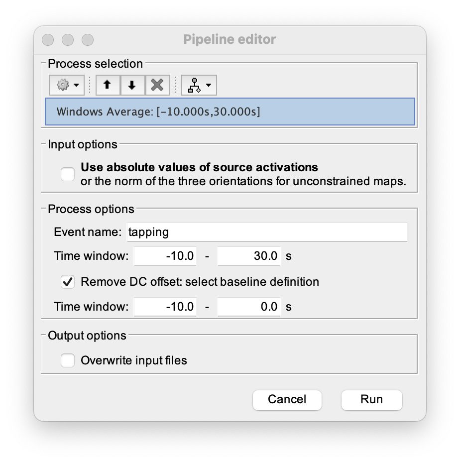

# process_windows_average
Authors: Edouard Delaire  
Maintainer: @Edouard2laire  
Version: 0.0.1  
Status: alpha  

## Description
This process is just a convenience way for doing windows averaging has it is described in [Nirs finger tapping tutorial ](https://neuroimage.usc.edu/brainstorm/Tutorials/NIRSFingerTapping#Window_averaging).
It allow you to process windows average with a windows of a given size for a given set of events( even of this event is extended) and will allow to see the return to baseline / undershoot after stimulation.

## Screenshots

## Known issues
None

## Further Update 
Using West algorithm as in bs-_avg_file in order ton compute standart deviation. 
